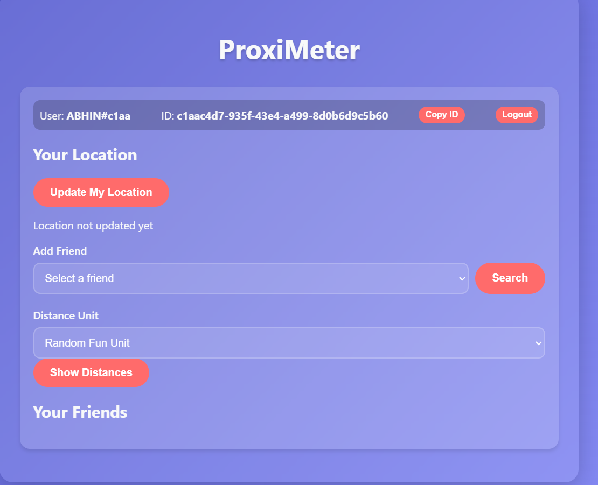

# PROXIMETER 🎯

## Basic Details
### Team Name: PAKALVELICHAM

### Team Members
- Team Lead: AASHWIN SURESH - SREE CHITRA THIRUNAL COLLEGE OF ENGINEERING
- Member 2: ABHIN.C - SREE CHITRA THIRUNAL COLLEGE OF ENGINEERING

### Project Description
OUR PROJECT FINDS FRIENDS LOCATION IN A DIFFERENT WAY:
LIKE INSTEAD OF FINDING IN LOCATION KMS IT WILL RANDOMLY REPRESENT HOW MANY FAR AWAY IN REAL WORLD OBJECT.FRIENDS IS 12000 BANANA AWAY

### The Problem (that doesn't exist)
QUIET CHALLENGING .GIVES GOOD EXCERSISE

### The Solution (that nobody asked for)
JUST GIVING THEM ONLY  INFO ABOUT HOW BANANAS AWAY

## Technical Details
### Technologies/Components Used
For Software:
- PYTHON,HTML,JS
- [Frameworks used]
- [Libraries used]
- [Tools used]

For Hardware:
- [List main components]
- [List specifications]
- [List tools required]

### Implementation
For Software:
# Installation
[commands]

# Run
app.py

### Project Documentation
For Software:

# Screenshots (Add at least 3)

*Add caption explaining what this shows*

*Add caption explaining what this shows*

*Add caption explaining what this shows*

# Diagrams

*Add caption explaining your workflow*

For Hardware:

# Schematic & Circuit

*Add caption explaining connections*

*Add caption explaining the schematic*

# Build Photos

*List out all components shown*

*Explain the build steps*

*Explain the final build*

### Project Demo
# Video
[Add your demo video link here]
*Explain what the video demonstrates*

# Additional Demos
[Add any extra demo materials/links]

## Team Contributions
- [Name 1]: [Specific contributions]
- [Name 2]: [Specific contributions]
- [Name 3]: [Specific contributions]

---
Made with ❤️ at TinkerHub Useless Projects 

